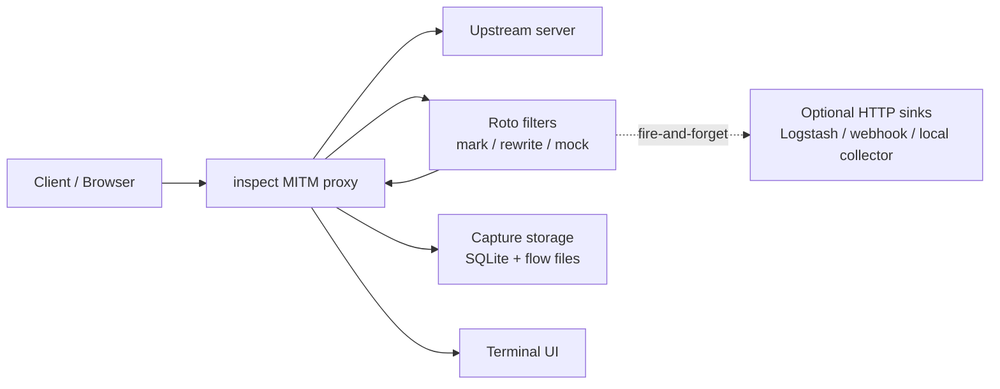

# inspect

`inspect` is a Rust-based HTTP/HTTPS MITM proxy with a terminal UI for live traffic inspection.

It captures request/response metadata into SQLite and stores raw headers/bodies on disk per flow.


## Overview


## MITM flow and operating modes

Inspect terminates downstream TLS and creates a separate upstream connection. This
makes HTTP traffic observable and capturable, but it also means that semantic
request/response mutation and upstream browser emulation must remain separate
layers.

### Design principles

- **Roto is a semantic MITM-termination layer.** It can inspect, mark, rewrite,
  synthesize, or drop HTTP flows when enabled.
- **Browser, TLS, and HTTP/2 emulation are upstream transport concerns.** They
  run after request-side semantic processing and before the origin is contacted.
- **Capture is independent from Roto mutation.** Request/response capture, SQLite
  metadata, HAR export data, TLS metadata, and TUI events remain enabled in both
  operating modes.
- **Protocol cleanup occurs immediately before upstream wire transmission.**
  Hop-by-hop headers and body-integrity metadata must not be forwarded after a
  semantic rewrite.
- **WebSocket upgrades are a separate HTTP/1.1 path.** They do not use the
  ordinary HTTP cleanup path, and their upgraded payload frames are relayed rather
  than captured as HTTP bodies.
- **ALPN is negotiated, not assumed.** Normal upstream HTTPS offers `h2` and
  `http/1.1`. The origin or upstream route selects a protocol; if ALPN is absent,
  Inspect safely falls back to HTTP/1.1 rather than forcing HTTP/2.

### Mode behavior
| Capability | `observe` | `emulate` |
| --- | --- | --- |
| Roto request, response, and completed filters | enabled | disabled |
| Request/response patches | enabled | disabled |
| Synthetic response and client-response drop | enabled | disabled |
| Roto outbound HTTP jobs | enabled | disabled |
| Request/response capture and SQLite metadata | enabled | enabled |
| Upstream TLS metadata and HAR-oriented records | enabled | enabled |
| Browser/TLS/HTTP emulation | optional | prioritized |
| Upstream HTTP/2 via ALPN | supported | supported |

`emulate` exists to prioritize browser-like upstream wire behavior. In this mode,
Roto is deliberately disabled so that semantic mutation cannot make browser
profiles, HTTP headers, request bodies, TLS fingerprints, or HTTP/2 behavior
internally inconsistent.

### Ordinary HTTP request path

```text
downstream browser
  ↓
MITM TLS termination
  ↓
Roto request filter and request action             (observe only)
  ↓
capture request
  ↓
protocol cleanup
  - hop-by-hop header removal
  - body-integrity header adjustment
  ↓
browser / TLS / HTTP emulation
  ↓
upstream origin
```

A request filter can rewrite a request, return a synthetic response, or stop the
flow before upstream access. Capture records the effective request after an
enabled request action has been applied. Cleanup is intentionally later: it
prepares the request for the actual upstream protocol without becoming part of
the semantic Roto API.

### Ordinary HTTP response path

```text
upstream origin
  ↓
browser-like response handling / decompression
  ↓
Roto response filter and response action           (observe only)
  ↓
capture response
  ↓
downstream browser
```

Response capture records the effective response after an enabled response action
has been applied. Capture also records the upstream response HTTP version and,
when available, upstream TLS metadata including the selected ALPN protocol.

### HTTP version and ALPN behavior

Downstream and upstream HTTP versions are independent:

```text
browser -- HTTP/2 --> inspect -- TLS ALPN --> origin
```

For upstream HTTPS, Inspect offers both `h2` and `http/1.1`.

| Upstream ALPN result | Upstream HTTP behavior |
| --- | --- |
| `h2` | use HTTP/2 |
| `http/1.1` | use HTTP/1.1 |
| no ALPN selected | use the safe HTTP/1.1 fallback |

A CDN edge or an upstream-proxy route may legitimately leave ALPN unselected even
when the client offered both protocols. This is not an HTTP/2 failure by itself;
the HTTP/1.1 fallback preserves interoperability. Inspect must not force HTTP/2
on such a connection.

## Features
- HTTP and HTTPS proxying
- MITM inspection for TLS traffic
- Live terminal UI for captured packets
- SQLite-backed metadata storage
- Per-flow request/response header and body dumps
- Optional upstream proxy support
- Optional SSL key log file output for TLS debugging
- File-based structured logging via `tracing_subscriber`
- Roto-based request/response filtering and rewriting

## Setup

### Vendored dependencies

This project uses patched local copies of some dependencies under `ext/`.

Initialize patched vendored dependencies first:

```bash
just setup-ext
```

This clones and patches:

- `ext/rama`
  - `patches/rama-0.3.1-tls-fix.patch`
- `ext/tuie`
  - `patches/tuie-0.2.3-scroll-fix.patch`

Useful maintenance commands:
```bash
just check-patches
just reset-ext
just recreate-ext
```

If you modify the vendored dependencies, update the patch files with:
```bash
just update-rama-patch
just update-tuie-patch
```

### CA
Generate a local CA certificate for client trust setup:
```text
$HOME/.inspect/mitm-root-ca.crt
```

```bash
cargo run -- --generate-ca
```


## Build
Initialize patched vendored dependencies first:
```bash
cargo install cargo-zigbuild
cargo zigbuild --release
```

## Run
```bash
cargo run -- --ip 127.0.0.1 --port 62019
```

Open an existing capture in read-only viewer mode:
```bash
cargo run -- --view-capture capture/20260602143000Z
```

## Usage
```text
Usage: inspect [OPTIONS]

Options:
      --config <FILE>
          Config TOML file path [default: config.toml]
  -p, --port <PORT>
          Set port to listen on [default: 62019]
  -i, --ip <IP>
          Set ip to listen on [default: 127.0.0.1]
      --view-capture <DIR>
          Open an existing capture directory in read-only TUI view mode
  -v...
          Log verbosity level. -vv for more verbosity. Environmental variable `RUST_LOG` overrides this flag!
      --upstream-proxy [<UPSTREAM_PROXY>]
          Upstream proxy address in format 'host:port'
      --ua-profile <UA_PROFILE>
          UA for normal upstream HTTP requests [default: auto] [possible values: auto, chrome, firefox]
      --connect-ua-profile <CONNECT_UA_PROFILE>
          UA for upstream proxy CONNECT. If omitted, inherits --ua-profile [possible values: auto, chrome, firefox]
      --proxy-mode <PROXY_MODE>
          [default: observe] [possible values: observe, emulate]
      --upstream-handshake-timeout-ms <UPSTREAM_HANDSHAKE_TIMEOUT_MS>
          Upstream connect/TLS handshake timeout in milliseconds [default: 10000]
      --upstream-request-timeout-sec <UPSTREAM_REQUEST_TIMEOUT_SEC>
          Upstream request/read timeout in seconds [default: 60]
      --body-save-limit-bytes <BODY_SAVE_LIMIT_BYTES>
          Maximum bytes to save per captured body [default: 3072]
      --body-save-unlimited
          Save captured bodies without truncation
      --body-omit-content-types <BODY_OMIT_CONTENT_TYPES>
          Do not save bodies for matching Content-Type prefixes
      --generate-ca
          Generate (or reuse) persistent local MITM root CA and exit
      --force-regenerate-ca
          Force regenerate local MITM root CA
      --preshared-key-log [<PRESHARED_KEY_LOG>]
          SSLKEYLOGFILE environment variable
      --tui-time-mode <TUI_TIME_MODE>
          TUI time mode: rfc3339|absolute|elapsed|epoch [default: rfc3339z] [possible values: rfc3339z, absolute, elapsed, epoch]
      --tui-time-format <TUI_TIME_FORMAT>
          TUI absolute time format (chrono strftime style) [default: %H:%M:%S%.3f]
      --tui-time-tz <TUI_TIME_TZ>
          TUI timezone: local|utc|+09:00|-05:30 [default: utc]
  -h, --help
          Print help
  -V, --version
          Print version
```
### Filter state configuration

`inspect` supports connection/flow-scoped state for Roto filters (`state_get/state_put/state_delete`).

Configure limits and TTL in `config.toml`:

```toml
[filter_state]
enabled = true
ttl_sec = 60
max_entry_bytes = 262144
max_connection_bytes = 2097152
max_filter_bytes = 16777216
max_total_bytes = 134217728
sweep_interval_sec = 5
```

Field meanings:

- `enabled`: enable/disable state storage
- `ttl_sec`: expiration time for state entries
- `max_entry_bytes`: max bytes per single key
- `max_connection_bytes`: max bytes per connection/flow scope
- `max_filter_bytes`: max bytes per filter namespace
- `max_total_bytes`: global max bytes across all state entries
- `sweep_interval_sec`: expiration sweep interval


## Output
Capture data is written under `capture/<timestamp>/`.

Typical layout:
```text
capture/
 20260602143000Z/
  index.sqlite
  flows/
   000001-xxxxxxxx/
    request.head
    request.body
    response.head
    response.body
    ssl_tls.json
```
Depending on the flow type and available TLS metadata, `ssl_tls.json` may also be written.

`ssl_tls.json` contains TLS-related metadata observed by inspect. When
`--upstream-proxy` is used, the upstream remote address recorded in metadata is
the upstream proxy endpoint inspect connected to. It should not be interpreted as
the final origin server or CDN edge IP chosen by the upstream proxy.

If a captured body has `Content-Encoding`, the saved body file may include an encoding
suffix while still preserving the original bytes:
```text
response.body.gz
response.body.br
response.body.zst
response.body.deflate
```

Full-text search supports encoded body files with `.gz`, `.br`, and `.zst`
suffixes. `.deflate` files are preserved but deflate search is best-effort.
HTTP `Content-Encoding: deflate` is rarely seen in modern traffic: historically,
some implementations interpreted it as zlib-wrapped deflate while others used
raw deflate, so gzip/br/zstd are generally more predictable in practice.


## Viewer mode
Use --view-capture to open an existing capture directory without starting the proxy.
```bash
inspect --view-capture capture/20260602143000Z
```
Viewer mode is read-only:
- The proxy is not started.
- No new capture directory is created.
- `index.sqlite` is opened read-only.
- Existing `flows/` files are used for detail view and full text search.

## TUI keys
- `?`: show / close help
- `q` / `Ctrl+C`: quit
- `j` / `Down`: move down
- `k` / `Up`: move up
- `J` / `Shift+Down`: page down
- `K` / `Shift+Up`: page up
- `h` / `Left`: move left
- `l` / `Right`: move right
- `G`: jump to bottom
- `Enter`: open details
- `Tab`: move to next focus
- `Shift+Tab`: move to previous focus
- `f`: filter packets
- `g`: full-text search
- `S`: export HAR
- `i`: show filter stats
- `n`: jump to the next retained full-text search result
- `p`: jump to the previous retained full-text search result

## Filtering

Press `f` to open the packet filter popup.

The filter supports compound conditions joined with `&&`.

Supported conditions:

- URL
    - Plain text matching
    - Regular expression matching with the `re:` prefix
- Status code
    - Prefixes: `status:`, `stat:`, `s:`
    - Exact status codes such as `200`
    - Status classes such as `2xx` or `5xx`
    - No response: `s:-`, `s:none`, `s:----`  
      Also works with `status:` and `stat:`
- HTTP method
    - Prefixes: `method:`, `meth:`, `m:`
- Combine conditions with `&&`
- Negate a condition with `!`
    - Examples: `!s:200`, `s:2xx && !s:204`, `!s:-`
- Use comma-separated values for OR within the same field
    - Examples: `s:200,403`, `s:2xx,3xx`, `method:GET,POST`

Examples:

Match URLs containing `windy.com`.
```text
windy.com
```
Match URLs using a regular expression.
```text
re:node.*\.com
```
Match URLs containing `windy.com` with status `200`.
```text
windy.com && stat:200
```
Match URLs containing `windy.com` with any `2xx` status.
```text
windy.com && status:2xx
```
Match `GET` requests with status `404`.
```text
method:GET && stat:404
```
Match `POST` requests with any `5xx` status.
```text
m:POST && s:5xx
```
Match requests with no response.
```text
s:-
```
Match responses that are not `200`.
```text
!s:200
```
Match successful responses except `204`.
```text
s:2xx && !s:204
```
Match either `200` or `403`.
```text
s:200,403
```
Match either `GET` or `POST` requests with a response.
```text
method:GET,POST && !s:-
```
Match URL regex and status `200`.
```text
re:/api/v\d+ && stat:200
```

## Roto filters

Request/response filtering and rewriting can be configured with Roto scripts.

Response filters can also enqueue fire-and-forget outbound HTTP jobs to named
clients configured in `config.toml`, for example to send captured data to
Logstash, a webhook receiver, or a local HTTP ingestion service.

See [Roto filters documentation](docs/roto-filters.md).


## Full text search

Press `g` to open the full text search popup.

Full text search supports:

- Plain text matching, case-sensitive
- Regular expression matching with the `re:` prefix

Example:
```text
re:(?i)region
```

After selecting a result and closing the search popup, the search results are
retained until the next full text search selection.

Use:
- `n`: jump to the next retained search result
- `p`: jump to the previous retained search result


## Notes
- HTTPS inspection requires trusting the local CA/certificate used by the proxy.
- Bodies are stored with a size limit, so large payloads may be truncated.
- This project is intended for local debugging and traffic analysis.
- CA certificate can be generated/exported locally for client trust setup.
- Metadata is stored in SQLite using SQLx.
- Non-text bodies may be rendered as hex for inspection.
- The packet detail view includes the flow directory for easier correlation with on-disk captures.
- Auto-scroll follows appended items even when scrollbar remains at top. [^1]
- Upstream TLS metadata in `ssl_tls.json` depends on the local rama TLS patch. [^2]

## WebSocket / WSS handling

WebSocket connections are handled as follows:

1. The WebSocket handshake is treated as an HTTP flow.
2. After `101 Switching Protocols`, the upgraded WebSocket stream is relayed transparently.
3. WebSocket payload frames are not captured by inspect.

This is intentional. WebSocket connections can be long-lived and may produce unbounded bidirectional
traffic, which does not fit well into inspect's request/response based capture model.

Use `--preshared-key-log` without a value to write TLS secrets to `/tmp/sslkeys.log`,
or pass a path to use a custom SSL key log file.

If you need to inspect WebSocket payloads, use packet capture tools together with TLS key logging, for example:
```bash
SSLKEYLOGFILE=/tmp/sslkeys.log inspect --preshared-key-log /tmp/sslkeys.log ...
```


Then capture packets in another terminal:
```bash
sudo tcpdump -i any -w /tmp/ws.pcap
```
Then open the pcap in Wireshark and configure the TLS pre-master secret log file:
```text
Preferences -> Protocols -> TLS -> (Pre)-Master-Secret log filename
```

Set it to:
```text
/tmp/sslkeys.log
```

Note that MITM proxying creates separate TLS sessions:
```text
client <-> inspect <-> upstream
```

Depending on where you capture packets and which TLS session you want to decrypt, you may need the corresponding key log.


[^1]: Temporary patch applied to tuie 0.2 crate `patches/tuie-0.2.4-scroll-fix.patch`
[^2]: Temporary patch applied to rama 0.3.1 crate `patches/rama-0.3.1-tls-fix.patch`