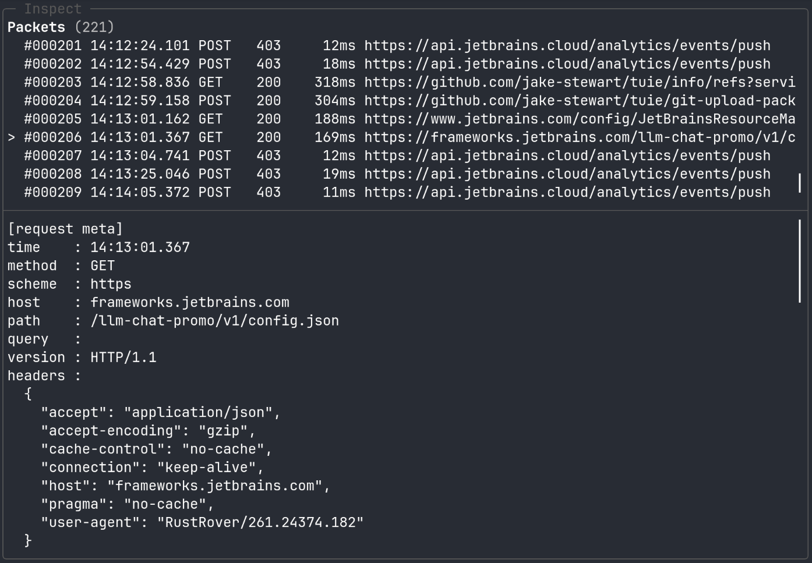

# inspect

`inspect` is a Rust-based HTTP/HTTPS MITM proxy with a terminal UI for live traffic inspection.

It captures request/response metadata into SQLite and stores raw headers/bodies on disk per flow.




## Features
- HTTP and HTTPS proxying
- MITM inspection for TLS traffic
- Live terminal UI for captured packets
- SQLite-backed metadata storage
- Per-flow request/response header and body dumps
- Optional upstream proxy support
- Optional SSL key log file output for TLS debugging
- File-based structured logging via `tracing_subscriber`

## Setup

### Vendored dependencies

This project uses patched local copies of some dependencies under `ext/`.

Initialize them before building:

```bash
just setup-ext
```

This clones and patches:

- `ext/rama`
  - `patches/rama-0.3.0-alpha.4-tls-fix.patch`
- `ext/tuie`
  - `patches/tuie-0.2.3-scroll-fix.patch`

Useful maintenance commands:
```bash
just check-patches
just reset-ext
just recreate-ext
```

If you modify the vendored dependencies, update the patch files with:
```bash
just update-rama-patch
just update-tuie-patch
```

### CA
Generate a local CA certificate for client trust setup:
```text
$HOME/.inspect/mitm-root-ca.crt
```

```bash
cargo run -- --generate-ca
```

Initialize patched vendored dependencies first:

## Build
```bash
cargo install cargo-zigbuild
cargo zigbuild --release
```

## Run
```bash
cargo run -- --ip 127.0.0.1 --port 62019
```

Open an existing capture in read-only viewer mode:
```bash
cargo run -- --view-capture capture/20260602143000Z
```

## Usage
```text
Usage: inspect [OPTIONS]

Options:
      --config <FILE>
          Config TOML file path [default: config.toml]
  -p, --port <PORT>
          Set port to listen on [default: 62019]
  -i, --ip <IP>
          Set ip to listen on [default: 127.0.0.1]
      --view-capture <DIR>
          Open an existing capture directory in read-only TUI view mode
  -v...
          Log verbosity level. -vv for more verbosity. Environmental variable `RUST_LOG` overrides this flag!
      --upstream-proxy [<UPSTREAM_PROXY>]
          Upstream proxy address in format 'host:port'
      --ua-profile <UA_PROFILE>
          UA for normal upstream HTTP requests [default: auto] [possible values: auto, chrome, firefox]
      --connect-ua-profile <CONNECT_UA_PROFILE>
          UA for upstream proxy CONNECT. If omitted, inherits --ua-profile [possible values: auto, chrome, firefox]
      --proxy-mode <PROXY_MODE>
          [default: observe] [possible values: observe, emulate]
      --upstream-handshake-timeout-ms <UPSTREAM_HANDSHAKE_TIMEOUT_MS>
          Upstream connect/TLS handshake timeout in milliseconds [default: 10000]
      --upstream-request-timeout-sec <UPSTREAM_REQUEST_TIMEOUT_SEC>
          Upstream request/read timeout in seconds [default: 60]
      --body-save-limit-bytes <BODY_SAVE_LIMIT_BYTES>
          Maximum bytes to save per captured body [default: 3072]
      --body-save-unlimited
          Save captured bodies without truncation
      --generate-ca
          Generate (or reuse) persistent local MITM root CA and exit
      --force-regenerate-ca
          Force regenerate local MITM root CA
      --preshared-key-log [<PRESHARED_KEY_LOG>]
          SSLKEYLOGFILE environment variable
      --tui-time-mode <TUI_TIME_MODE>
          TUI time mode: rfc3339|absolute|elapsed|epoch [default: rfc3339z] [possible values: rfc3339z, absolute, elapsed, epoch]
      --tui-time-format <TUI_TIME_FORMAT>
          TUI absolute time format (chrono strftime style) [default: %H:%M:%S%.3f]
      --tui-time-tz <TUI_TIME_TZ>
          TUI timezone: local|utc|+09:00|-05:30 [default: utc]
  -h, --help
          Print help
  -V, --version
          Print version
```

## Output
Capture data is written under `capture/<timestamp>/`.

Typical layout:
```text
capture/
 20260602143000Z/
  index.sqlite
  flows/
   000001-xxxxxxxx/
    request.head
    request.body
    response.head
    response.body
    ssl_tls.json
```
## Viewer mode
Use --view-capture to open an existing capture directory without starting the proxy.
```bash
inspect --view-capture capture/20260602143000Z
```
Viewer mode is read-only:
- The proxy is not started.
- No new capture directory is created.
- `index.sqlite` is opened read-only.
- Existing `flows/` files are used for detail view and full text search.

## TUI keys
- `?` / `help`: show / close help
- `q` / `Ctrl+C`: quit
- `j` / `Down`: move down
- `k` / `Up`: move up
- `J` / `Shift+Down`: page down
- `K` / `Shift+Up`: page up
- `h` / `Left`: move left
- `l` / `Right`: move right
- `G`: jump to bottom
- `Enter`: open details
- `Tab`: move to next focus
- `Shift+Tab`: move to previous focus
- `f`: filter packets
- `g`: full text search
- `n`: jump to the next retained full text search result
- `p`: jump to the previous retained full text search result

## Filtering

Press `f` to open the packet filter popup.

The filter supports compound conditions joined with `&&`.

Supported conditions:

- URL
    - Plain text matching
    - Regular expression matching with the `re:` prefix
- Status code
    - Prefixes: `status:`, `stat:`, `s:`
    - Exact status codes such as `200`
    - Status classes such as `2xx` or `5xx`
    - No response: `s:-`, `s:none`, `s:----`  
      Also works with `status:` and `stat:`
- HTTP method
    - Prefixes: `method:`, `meth:`, `m:`
- Combine conditions with `&&`
- Negate a condition with `!`
    - Examples: `!s:200`, `s:2xx && !s:204`, `!s:-`
- Use comma-separated values for OR within the same field
    - Examples: `s:200,403`, `s:2xx,3xx`, `method:GET,POST`

Examples:

Match URLs containing `windy.com`.
```text
windy.com
```
Match URLs using a regular expression.
```text
re:node.*\.com
```
Match URLs containing `windy.com` with status `200`.
```text
windy.com && stat:200
```
Match URLs containing `windy.com` with any `2xx` status.
```text
windy.com && status:2xx
```
Match `GET` requests with status `404`.
```text
method:GET && stat:404
```
Match `POST` requests with any `5xx` status.
```text
m:POST && s:5xx
```
Match requests with no response.
```text
s:-
```
Match responses that are not `200`.
```text
!s:200
```
Match successful responses except `204`.
```text
s:2xx && !s:204
```
Match either `200` or `403`.
```text
s:200,403
```
Match either `GET` or `POST` requests with a response.
```text
method:GET,POST && !s:-
```
Match URL regex and status `200`.
```text
re:/api/v\d+ && stat:200
```


## Full text search

Press `g` to open the full text search popup.

Full text search supports:

- Plain text matching, case-sensitive
- Regular expression matching with the `re:` prefix

Example:
```text
re:(?i)region
```

After selecting a result and closing the search popup, the search results are retained until the next full text search selection.

Use:
- `n`: jump to the next retained search result
- `p`: jump to the previous retained search result


## Notes
- HTTPS inspection requires trusting the local CA/certificate used by the proxy.
- Bodies are stored with a size limit, so large payloads may be truncated.
- This project is intended for local debugging and traffic analysis.
- CA certificate can be generated/exported locally for client trust setup.
- Metadata is stored in SQLite using SQLx.
- Non-text bodies may be rendered as hex for inspection.
- The packet detail view includes the flow directory for easier correlation with on-disk captures.
- Auto-scroll follows appended items even when scrollbar remains at top. [^1]


## WebSocket / WSS handling

WebSocket connections are handled as follows:

1. The WebSocket handshake is treated as an HTTP flow.
2. After `101 Switching Protocols`, the upgraded WebSocket stream is relayed transparently.
3. WebSocket payload frames are not captured by inspect.

This is intentional. WebSocket connections can be long-lived and may produce unbounded bidirectional traffic, which does not fit well into inspect's request/response based capture model.

If you need to inspect WebSocket payloads, use packet capture tools together with TLS key logging, for example:
```bash
SSLKEYLOGFILE=/tmp/sslkeys.log inspect --preshared-key-log /tmp/sslkeys.log ...
```
Then capture packets in another terminal:
```bash
sudo tcpdump -i any -w /tmp/ws.pcap
```
Then open the pcap in Wireshark and configure the TLS pre-master secret log file:
```text
Preferences -> Protocols -> TLS -> (Pre)-Master-Secret log filename
```

Set it to:
```text
/tmp/sslkeys.log
```

Note that MITM proxying creates separate TLS sessions:
```text
client <-> inspect <-> upstream
```

Depending on where you capture packets and which TLS session you want to decrypt, you may need the corresponding key log.


[^1]: Temporary patch applied to tuie 0.2 crate `patches/tuie-0.2-scroll-fix.patch`
