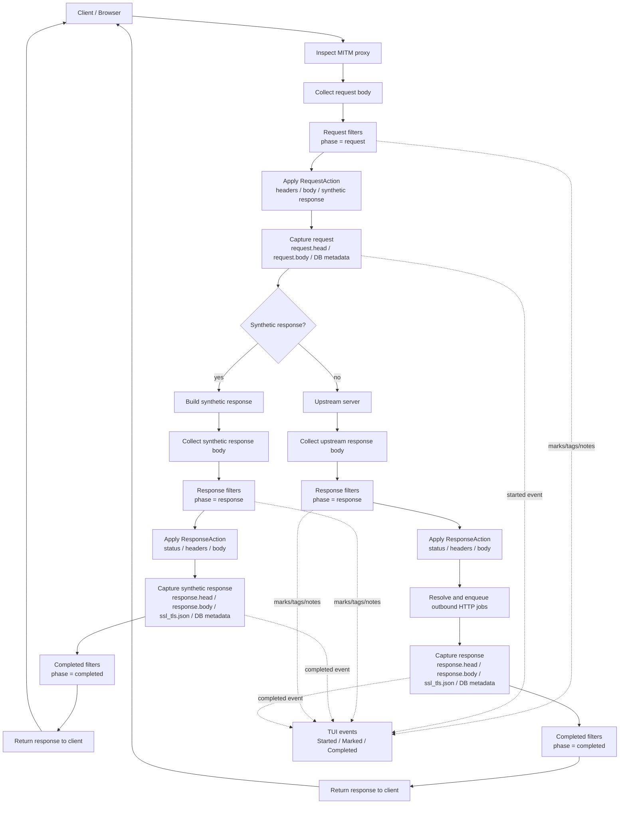

# Roto Filters

Inspect can load Roto scripts from the `filters/` directory and use them to filter, mark, rewrite, and optionally emit outbound HTTP jobs for HTTP request/response flows.

This feature is under active development. This document describes the currently exposed Roto runtime API and calls out known gaps separately.

## Overview

Roto filters are stored as `.roto` files under:

```text
filters/*.roto
```

Each file can define metadata in TOML front matter and one or more Roto functions.

Filters can currently match these phases:

- `request`
- `response`
- `completed`

The currently useful script entry points are:

```text
fn request_action(req: Request) -> RequestAction
fn response_action(res: Response) -> ResponseAction
```

Legacy/simple entry points such as `on_request`, `on_response`, `request_mark`,
`response_mark`, `request_header_name`, `request_header_value`,
`response_header_name`, `response_header_value`, `request_body`,
`request_body_content_type`, `response_body`, and `response_body_content_type`
may also be detected by the runtime, but new filters should prefer
`request_action` and `response_action`.

Every executable `.roto` filter must currently define:

```rust
fn ping() -> bool {
    true
}
```

## Where filters run

Roto filters run inside the HTTP MITM flow after request/response bodies are collected.

Synthetic responses follow the same response dispatch/capture path as upstream
responses: the request is captured first, then the synthetic response is filtered,
captured, and returned to the client.

Completed filters are invoked after response capture, but completed-phase action
side effects are still limited; see the completed phase section below.



Current filtering points:

| Phase | Can inspect | Can modify | Can synthesize response | Typical use |
| --- | --- | --- | --- | --- |
| `request` | request method/scheme/host/path/query | request headers/body | yes | mock, request rewrite, marking |
| `response` | response status/version/content type/body text | response status/headers/body | no | response rewrite, marking, outbound HTTP jobs |
| `completed` | completed flow internally | no request/response rewrite | no | currently matched/invoked only; user-defined completed action side effects are not yet wired |

The main current use cases are:

- mark matching request/response flows in the TUI
- add/remove request headers
- rewrite request body
- return a synthetic response without upstream access
- add/remove response headers
- rewrite response status/body
- enqueue outbound HTTP jobs from response filters

## File format

Each `.roto` file may start with TOML front matter written as comments.

Example:

```rust
//! +++
//! name = "api v1 request"
//! enabled = true
//!
//! [trigger]
//! host = ["*"]
//! path = ["/v1/*", "/mock"]
//! method = ["GET", "POST"]
//! phase = ["request"]
//! +++

fn ping() -> bool {
    true
}

fn request_action(req: Request) -> RequestAction {
    if req.path() == "/mock" {
        RequestAction.pass()
            .mark("mocked")
            .synthetic_response(
                200,
                "<!doctype html><html><body><h1>Hello from Roto</h1></body></html>",
                "text/html; charset=utf-8",
            )
    } else {
        RequestAction.pass()
    }
}
```

## Front matter

Front matter is TOML.

Supported fields:

```toml
name = "filter name"
enabled = true
priority = 100

[trigger]
host = ["*"]
path = ["*"]
method = ["GET", "POST"]
phase = ["request", "response", "completed"]
```

### `name`

Human-readable filter name.

If omitted, the file name is used.

### `enabled`

Whether this filter is enabled.

```toml
enabled = true
```

Disabled filters are skipped.

### `priority`

Controls filter order.

Lower values run earlier.

If omitted, priority is read from the file name prefix.

```text
000-generic.roto        -> priority 0
100-api-v1-request.roto -> priority 100
```

If both TOML `priority` and file name priority are present, TOML wins.

### `trigger`

Controls when a filter matches.

```toml
[trigger]
host = ["*"]
path = ["/v1/*"]
method = ["GET"]
phase = ["request"]
```

If a trigger field is omitted, it is treated as matching all values.

## Trigger matching

### Host

Supports simple glob-like patterns.

Host matching is case-insensitive.

Examples:

```text
host = ["*"]
host = ["example.com"]
host = ["*.example.com"]
```

### Path

Supports simple glob-like patterns.

Path matching is case-insensitive in the current glob implementation.

Examples:

```text
path = ["*"]
path = ["/mock"]
path = ["/v1/*"]
```

### Method

Exact match, case-insensitive.

Examples:

```toml
method = ["GET", "POST"]
```

### Phase

Supported values:

```text
phase = ["request"]
phase = ["response"]
phase = ["completed"]
```

Multiple phases can be specified:

```text
phase = ["request", "response"]
```

If `phase` is omitted or empty, the filter can match all phases.

## Roto syntax notes

Roto method/static calls use `.` rather than Rust-style `::`.

Correct:

```text
RequestAction.pass()
```

Incorrect:

```text
RequestAction::pass()
```

## Why `ping()` is required

Executable Roto filters should define:

```rust
fn ping() -> bool {
    true
}
```

`ping()` is not an HTTP/WebSocket ping and is not related to network keepalive.

Inspect uses it as a simple validation hook when loading a `.roto` file.

The goals are:

- verify that the script compiled successfully
- verify that Inspect can call into the compiled Roto program
- fail the filter early during reload instead of failing later during request handling
- keep runtime request/response processing free from repeated "missing function" checks

If `ping()` is missing or returns an error, the filter file is treated as invalid and skipped during reload when possible.

TODO:

- [ ] Make the `ping()` error message more explicit.
- [ ] Consider replacing `ping()` with a more descriptive required function name, such as `inspect_filter()` or `validate()`.
- [ ] Consider allowing metadata-only filters without `ping()`.

## Request API

The `Request` object is available in request filters.

Currently exposed methods:

```text
req.method()
req.scheme()
req.host()
req.path()
req.query()
req.content_type()
req.body_text()
req.state_get("key")
req.state_put("key", "value")
req.state_delete("key")
```

Example:

```rust
fn request_action(req: Request) -> RequestAction {
    if req.path() == "/v1/test" && req.method() == "GET" {
        RequestAction.pass().mark("api-v1")
    } else {
        RequestAction.pass()
    }
}
```

`req.content_type()` returns the request body content type when Inspect was able to
derive one, otherwise an empty string.

`req.body_text()` returns the request body decoded as text when available, otherwise
an empty string. Non-text or undecodable bodies are not exposed through this text API.

State API behavior:

- `req.state_get("key")` returns the stored value as text.
- If the key does not exist, it returns an empty string.
- `req.state_put("key", "value")` returns `true` on success, `false` on limit/rejection.
- `req.state_delete("key")` returns `true` if the key existed and was deleted.
- State is scoped to connection/flow context and filter name, and is bounded by TTL and configured limits.
- Values are stored as bytes internally; the current Roto API exposes text only.

Example (request-side counter):

```rust
fn request_action(req: Request) -> RequestAction {
    let current = req.state_get("counter");

    if current == "" {
        let _ok = req.state_put("counter", "1");
        return RequestAction.pass().mark("counter-init");
    }

    if current == "1" {
        let _ok = req.state_put("counter", "2");
        return RequestAction.pass().mark("counter-step2");
    }

    RequestAction.pass()
}
```


The underlying Rust filter model contains additional request data such as ID,
headers, raw body bytes, and TLS SNI, but those fields are not all exposed as Roto
methods yet.

TODO:

- [ ] Expose and document request ID access.
- [ ] Expose and document request header lookup.
- [x] Expose and document request body text access.
- [x] Expose and document request content type access.
- [ ] Expose and document raw/binary request body access if needed.
- [ ] Expose and document request TLS SNI access if needed.

## Response API

The `Response` object is available in response filters.

Currently exposed methods:

```text
req.content_type()
req.body_text()
res.status()
res.version()
res.content_type()
res.body_text()
res.state_get("key")
res.state_put("key", "value")
res.state_delete("key")
```

Example:

```rust
fn response_action(res: Response) -> ResponseAction {
    if res.status() >= 400 {
        ResponseAction.pass()
            .mark("error-response")
            .set_header("x-inspect-roto", "matched")
    } else {
        ResponseAction.pass()
    }
}
```

State API behavior in response phase is the same as request phase and uses the same
connection/flow+filter scoped state namespace.

Example (read state written in request phase):

```rust
fn response_action(res: Response) -> ResponseAction {
    let phase = res.state_get("phase");

    if phase == "" {
        let _ok = res.state_put("phase", "response");
        ResponseAction.pass().mark("state-init")
    } else {
        let _ok = res.state_delete("phase");
        ResponseAction.pass().mark("state-clear")
    }
}
```

Header lookup is not currently exposed as a Roto method.

TODO:

- [ ] Expose and document response header lookup.
- [ ] Expose and document upstream status if needed.
- [ ] Expose and document elapsed time if needed.

## RequestAction API

Preferred request filter function:

```text
fn request_action(req: Request) -> RequestAction
```

Currently exposed methods:

```text
RequestAction.pass()
    .mark("label")
    .set_header("name", "value")
    .remove_header("name")
    .set_body_text("body", "text/plain; charset=utf-8")
    .replace_body_text("old", "new")
    .replace_body_text_once("old", "new")
    .replace_body_text_all("old", "new")
    .replace_body_regex("pattern", "replacement")
    .replace_body_text_when_contains("anchor", "old", "new")
    .replace_js_property("property", "old", "new")
    .replace_css_declaration("property", "old", "new")
    .replace_html_attribute("selector", "attribute", "old", "new")
    .apply_json_patch("[{"op":"replace","path":"/name","value":"new"}]", "application/json")
    .synthetic_response(200, "body", "text/plain; charset=utf-8")
    .drop()
    .stop()
```

The Rust patch model has fields for path and query rewrites, but `set_path()` and
`set_query()` are not currently exposed in the Roto runtime API.

TODO:

- [ ] Expose `set_path("/new-path")`.
- [ ] Expose `set_query("a=1&b=2")`.
- [ ] Expose `mark_color("label", "color")` or remove it from the public design.
- [ ] Add richer action APIs for tags and notes.

### Marking

Marks are currently mainly UI annotations, but are intended to remain lightweight
flow metadata that future processing stages may use for routing or policy decisions.

```rust
fn request_action(req: Request) -> RequestAction {
    RequestAction.pass()
        .mark("matched")
}
```

Marks are currently shown inline in the TUI packet list.

Example:

```text
#000123 ... [matched] https://example.com/path
```
At the moment, marks are mainly a UI annotation mechanism. They are also intended
to remain lightweight flow metadata, so future processing stages may use them for
routing, policy decisions, or L7-switch/mangle-like behavior.


### Header rewrite

```rust
fn request_action(req: Request) -> RequestAction {
    RequestAction.pass()
        .set_header("x-roto", "request")
        .remove_header("x-remove-me")
}
```

### Body rewrite

```rust
fn request_action(req: Request) -> RequestAction {
    RequestAction.pass()
        .set_body_text("rewritten request body\n", "text/plain; charset=utf-8")
}
```

When a request body is rewritten, Inspect removes body integrity/encoding headers such as:

- `content-length`
- `content-encoding`
- `etag`
- `content-md5`

### Synthetic response

A request filter can return a response directly without sending the request upstream.

```rust
fn request_action(req: Request) -> RequestAction {
    if req.path() == "/mock" {
        RequestAction.pass()
            .mark("mocked")
            .synthetic_response(
                200,
                "<!doctype html><html><body><h1>Hello from Roto</h1></body></html>",
                "text/html; charset=utf-8",
            )
    } else {
        RequestAction.pass()
    }
}
```

Synthetic responses are intended for mock/rewrite use cases where Inspect should
build the response locally and send it through the normal response filter/capture
path.

Current behavior:

- request metadata/body/head are captured first
- the synthetic response follows the normal response dispatch path
- response filters can run against the synthetic response
- response patches are applied before response capture
- `response.head`, `response.body`, response DB metadata, and `ssl_tls.json` are written
- upstream metadata is stored as absent/null
- elapsed time is measured from request start to synthetic response generation, so it may be `0ms`

If the goal is to suppress the client response or guarantee a hard block, prefer
`RequestAction.drop()`.

### Drop client response

A request filter can stop the request before upstream access.

```rust
fn request_action(req: Request) -> RequestAction {
    if req.path() == "/blocked" {
        return RequestAction.pass()
            .mark("blocked")
            .drop();
    }

    RequestAction.pass()
}
```

Current behavior:

- later request filters are not executed
- upstream access is skipped
- request metadata/body/head are captured
- no response is captured, so the TUI status is shown as no response / `----`
- Inspect returns an empty close response to the client
- no automatic mark is added; use `.mark("drop")` if the drop should be visible in the packet list

TODO:

- [ ] Decide whether `444` should remain the public behavior or become configurable.
- [ ] Decide whether response-phase `drop()` should be supported or removed from the Roto API.


### Stop filter chain

```rust
fn request_action(req: Request) -> RequestAction {
    RequestAction.pass()
        .mark("stop-here")
        .stop()
}
```

When `stop()` is used, later matching request filters are not executed.

Synthetic responses also stop request filter processing.


## ResponseAction API

Preferred response filter function:

```text
fn response_action(res: Response) -> ResponseAction
```

Currently exposed methods:

```text
ResponseAction.pass()
    .mark("label")
    .post_json("client-name", "/path", "{\"ok\":true}")
    .post_text("client-name", "/path", "body")
    .post_request_raw("client-name", "/request")
    .post_response_raw("client-name", "/response")
    .set_status(418)
    .set_header("name", "value")
    .remove_header("name")
    .set_body_text("body", "text/plain; charset=utf-8")
    .stop()
```

Outbound HTTP jobs require named outbound HTTP clients configured by Inspect in
`config.toml`. Roto scripts do not specify destination URLs directly; they refer
to a configured client by name.

Response actions can also rewrite the response returned to the browser by changing
the status, headers, or body.

They are fire-and-forget from the proxied flow's point of view: destination
responses are logged for diagnostics but are not passed back to Roto and do not
affect the browser response.

### Response status rewrite

```rust
fn response_action(res: Response) -> ResponseAction {
    if res.status() == 404 {
        ResponseAction.pass()
            .mark("rewritten-404")
            .set_status(200)
            .set_body_text("rewritten\n", "text/plain; charset=utf-8")
    } else {
        ResponseAction.pass()
    }
}
```

### Response body rewrite

```rust
fn response_action(res: Response) -> ResponseAction {
    ResponseAction.pass()
        .set_body_text(
            "<!doctype html><html><body><h1>Rewritten</h1></body></html>",
            "text/html; charset=utf-8",
        )
}
```

When a response body is rewritten, Inspect removes body integrity/encoding headers such as:

- `content-length`
- `content-encoding`
- `etag`
- `content-md5`

### Outbound HTTP jobs

Response filters can enqueue outbound HTTP jobs to named clients configured by Inspect.

This is a fire-and-forget integration mechanism for sending structured or raw
HTTP data to external systems such as Logstash, webhook receivers, local test
servers, or other HTTP ingestion services.

The destination must be registered in `config.toml` before it can be used from
Roto. Roto scripts refer to the configured destination by `name`; they do not
directly define the destination URL.

Example `config.toml`:

```toml
[[outbound_http_clients]]
name = "webhook"
base_url = "http://127.0.0.1:3000"
timeout_ms = 5000

[[outbound_http_clients]]
name = "logstash"
base_url = "http://localhost:5044"
timeout_ms = 5000
```

The Roto client name must match one of these configured `name` values.

For example, this sends a text payload to:

```text
http://localhost:5044/http-error
```

when `logstash` is configured with `base_url = "http://localhost:5044"`.

```rust
fn response_action(res: Response) -> ResponseAction {
    if res.status() >= 400 {
        ResponseAction.pass()
            .mark("send-error")
            .post_text("logstash", "/http-error", "upstream returned an error")
    } else {
        ResponseAction.pass()
    }
}
```

Payload behavior:

| Method | Sent content type | Payload |
| --- | --- | --- |
| `.post_json(...)` | `application/json` | JSON string provided by the Roto script |
| `.post_text(...)` | `text/plain; charset=utf-8` | text string provided by the Roto script |
| `.post_request_raw(...)` | `application/octet-stream` | decrypted captured request head/body bytes |
| `.post_response_raw(...)` | `application/octet-stream` | decrypted captured response head/body bytes |
| `.post_request_json(...)` | `application/json` | decrypted captured request converted to JSON |
| `.post_response_json(...)` | `application/json` | decrypted captured response converted to JSON |
| `.post_flow_json(...)` | `application/json` | decrypted captured request and response converted to one JSON document |

Captured JSON export notes:

- captured JSON export uses decrypted HTTP data already collected by Inspect
- the export intentionally favors the observed plaintext HTTP snapshot over Roto-mutated output
- this makes it useful for SIEM/search pipelines such as Logstash, where enrichment, redaction, normalization, indexing, routing, and alert-specific shaping can be handled downstream
- request/response headers are exported as arrays of `{ "name": "...", "value": "..." }`
- UTF-8 bodies are exported as `body.text`
- non-UTF-8 bodies are exported as `body.base64`
- body metadata such as `content_type`, `encoding`, and `truncated` is included where available
- `.post_flow_json(...)` is intended for Logstash/webhook-style ingestion where one event should contain both request and response data
- outbound export does not change the captured flow or the browser response

In other words, outbound JSON export is a decrypted observation/export hook. It is
not designed to be a "final rewritten wire image" API. If the exported data needs
redaction, enrichment, field mapping, filtering, or destination-specific shaping,
that should normally be done in the receiving pipeline such as Logstash.


URL resolution:

- if `path` is relative, Inspect sends to `base_url + "/" + path`
- if `path` starts with `http://` or `https://`, it is used as the full URL
- `base_url` is still required because the client must be registered by name

Behavior:

- jobs are queued after response filters run
- jobs are queued before response capture completes
- outbound HTTP is fire-and-forget from the proxied flow's point of view
- outbound HTTP responses are only logged and are not exposed back to Roto
- outbound HTTP success/failure does not modify the captured flow
- outbound HTTP success/failure does not modify the response sent to the browser
- captured raw request/response jobs are resolved to bytes before being sent
- request export is based on the request snapshot available before request patches are applied
- response export is resolved after response actions are applied, so it can include response rewrites
- unknown client names are dropped and logged
- jobs are dropped and logged if no outbound HTTP clients are configured
- jobs can be dropped and logged if the outbound queue is full or closed
- outbound HTTP runs outside Roto; Roto only creates structured jobs

Specialized packet-inspection or IDS/IPS test setups can also be built on top of
this mechanism, but those setups are environment-specific and are intentionally
not covered here.

Security boundary:

- Roto scripts do not get arbitrary filesystem access
- Roto scripts do not get arbitrary process execution
- Roto scripts do not get arbitrary network access
- outbound HTTP is limited to named clients configured by Inspect

### Outbound HTTP sink filter

This example posts raw captured request/response bytes to a named outbound HTTP
client.

The client name is just a configured sink name. It can point to Logstash, a local
HTTP test server, a webhook receiver, or any other HTTP ingestion service.

It requires a matching named outbound HTTP client in `config.toml`. If the client
is not configured, the jobs are dropped and logged.

```toml
[[outbound_http_clients]]
name = "logstash"
base_url = "http://localhost:5044"
timeout_ms = 5000
```

Use `.post_request_json(...)` or `.post_response_json(...)` instead when the sink
should receive request and response records separately.

```rust
fn response_action(res: Response) -> ResponseAction {
    ResponseAction.pass()
        .mark("logstash")
        .post_request_json("logstash", "/request")
        .post_response_json("logstash", "/response")
}
```

JSON export is based on Inspect's decrypted captured/filter data and intentionally
stays close to the observed plaintext HTTP traffic. This is useful for Logstash-like
pipelines because downstream tools can perform their own redaction, enrichment,
normalization, field mapping, routing, and indexing.

## Header rewrite behavior

### `set_header`

```text
RequestAction.pass()
    .set_header("x-example", "one")
```

```text
ResponseAction.pass()
    .set_header("x-example", "one")
```

Current behavior:

- header names are parsed using HTTP header name rules
- invalid header names are ignored and logged
- invalid header values are ignored and logged
- setting a header uses replacement semantics for that header name
- if the same header is set multiple times within the same patch, the last value wins at HTTP header-map level

Example:

```rust
fn response_action(res: Response) -> ResponseAction {
    ResponseAction.pass()
        .set_header("x-example", "one")
        .set_header("x-example", "two")
}
```

Expected final header:

```http
x-example: two
```

This means `set_header` is currently not an append operation.

TODO:

- [ ] Add explicit append support, e.g. `append_header("set-cookie", "...")`.
- [ ] Define special handling for multi-value headers.
- [ ] Define safer APIs for `set-cookie`, `cookie`, and comma-joined headers.
- [ ] Add `replace_header` alias if we want the API name to be clearer.

### `remove_header`

```text
RequestAction.pass()
    .remove_header("x-example")
```

```text
ResponseAction.pass()
    .remove_header("x-example")
```

Current behavior:

- header names are parsed using HTTP header name rules
- invalid names are ignored and logged
- removal is case-insensitive at HTTP header-map level

### Remove and set order

When applying a patch, Inspect removes headers first and then sets headers.

So this action:

```rust
fn response_action(res: Response) -> ResponseAction {
    ResponseAction.pass()
        .remove_header("x-example")
        .set_header("x-example", "new")
}
```

results in:

```http
x-example: new
```

TODO:

- [ ] Decide whether method call order should be preserved exactly.
- [ ] Consider representing header operations as an ordered list instead of separate `remove_headers` and `set_headers`.

## Path and query rewrite behavior

The Rust patch model supports request path and query rewrites internally, but the
current Roto runtime API does not expose `set_path()` or `set_query()`.

Planned API shape:

```rust
fn request_action(req: Request) -> RequestAction {
    RequestAction.pass()
        .set_path("/new-path")
        .set_query("a=1&b=2")
}
```

Intended behavior once exposed:

- `set_path()` replaces the URI path component
- `set_query()` replaces the URI query component
- if only path is set, the original query is preserved
- if only query is set, the original path is preserved
- invalid path/query combinations are ignored and logged

TODO:

- [ ] Expose `set_path()` in the Roto runtime.
- [ ] Expose `set_query()` in the Roto runtime.
- [ ] Define exact behavior for `set_query("")`.
- [ ] Add `remove_query()`.
- [ ] Add query helper APIs such as `set_query_param`, `remove_query_param`, and `append_query_param`.

## Body rewrite behavior

Request and response bodies can be rewritten as text.

```text
RequestAction.pass()
    .set_body_text("new request body\n", "text/plain; charset=utf-8")
```

```text
ResponseAction.pass()
    .set_body_text("new response body\n", "text/plain; charset=utf-8")
```

When a body is rewritten, Inspect removes or updates headers that may no longer be valid:

```text
content-length
content-encoding
etag
content-md5
```

`content-encoding` handling differs between request and response rewrites; see
the content-encoded bodies section below.

### Why these headers are removed

These headers often describe the original body bytes.

After rewriting the body:

- `content-length` may be wrong
- `content-encoding` may claim compression that no longer exists
- `etag` may no longer identify the body
- `content-md5` may no longer match the body

Keeping them can cause browser/protocol errors, corrupted rendering, or cache/integrity mismatches.

### Content-encoded bodies

For content-encoded bodies such as `gzip`, `br`, `zstd`, and `deflate`, Inspect
attempts to decode the body before exposing it through `req.body_text()` or
`res.body_text()`. Text rewrite helpers such as `replace_body_text_once()`,
`replace_body_text_all()`, and `replace_body_regex()` operate on that decoded text.

Request and response rewrites intentionally differ after a decoded body is changed.

For response rewrites, Inspect currently sends the rewritten body back to the client
as plain, uncompressed bytes and removes `content-encoding`. This avoids returning a
body whose bytes no longer match the original compression metadata.

For request rewrites, Inspect attempts to preserve the original `content-encoding`
when forwarding the request upstream. If the original request body used an encoding
such as `gzip`, Inspect rewrites the decoded text and then recompresses the rewritten
body using the original encoding before sending it to the server. If recompression
fails or the original encoding is unsupported, Inspect falls back to sending plain
bytes and removes `content-encoding`.

After a body rewrite, Inspect removes framing/integrity headers such as
`content-length`, `etag`, and `content-md5`. It does not attempt to update
application-specific checksums, signatures, authorization headers, or custom hash
headers. Servers may reject rewritten requests when such protections are present.

### Is `content-length` recalculated?

Inspect currently removes `content-length` when rewriting the body.

Inspect does not explicitly recalculate and reinsert `content-length` inside the Roto patch application itself.

The HTTP server/client stack may still frame the response correctly using the protocol's normal behavior, for example:

- HTTP/1.1 connection framing or chunked transfer
- HTTP/2 frame lengths
- automatically added required headers by lower layers

However, from the filter/capture point of view, rewritten bodies should be treated as having no explicit `content-length` unless a later layer adds one.


TODO:

- [ ] Decide whether Inspect should explicitly set a new `content-length` after body rewrite.
- [ ] Add tests for HTTP/1.1 rewritten body framing.
- [ ] Add tests for HTTP/2 rewritten body framing.
- [ ] Document capture behavior if lower layers add or omit `content-length`.
- [ ] Consider explicit per-phase compression rewrite policies for request and response bodies.

### Content type

If a content type is provided, Inspect sets `content-type` to that value.

```text
ResponseAction.pass()
    .set_body_text("<h1>Hello</h1>", "text/html; charset=utf-8")
```

If the content type is invalid, it is ignored and logged.

TODO:

- [ ] Add binary body rewrite API.
- [ ] Add JSON helper API.
- [ ] Add HTML helper API.

## Response head after patch

For response rewrites, `response.head` is saved after applying `response_action`
patches. The captured response head should therefore match the rewritten response
metadata sent back to the client.

## Mark colors

Internally, marks can carry an optional color.

Current Roto behavior:

- `mark(label)` creates a mark.
- Marks created by the current Roto API use the default green color.
- `mark_color(label, color)` is not currently exposed in the Roto runtime API.
- TUI rendering currently focuses on the label and may not visually apply the color yet.

Recommended future color names:

```text
red
green
yellow
blue
magenta
cyan
white
gray
```

Current built-in conventions:

| Source | Default color intent |
| --- | --- |
| Roto `mark(...)` | green |
| tags emitted as marks | green |
| notes emitted as marks | blue |

TODO:

- [ ] Expose `mark_color(label, color)` if colored marks should be scriptable.
- [ ] Define the official color palette.
- [ ] Validate color names during action conversion.
- [ ] Render colors in the packet list.
- [ ] Render marks/tags/notes in the detail pane.
- [ ] Decide how unknown colors should behave.

## Action merge and conflict behavior

Multiple filters can match the same request or response.

Filters are evaluated in priority order:

1. lower `priority` first
2. then file path/name order as a tie-breaker

Each filter returns an action. Inspect merges these actions into one combined action.

### Marks, tags, and notes

For request and response filters, marks, tags, and notes are accumulated into the combined action.

Example:

```text
RequestAction.pass().mark("a")
```

and later:

```text
RequestAction.pass().mark("b")
```

results in both marks being emitted:

```text
[a] [b]
```

Completed-phase action effects are still under development.

### `drop()`

Drop client response after response filters.

A response filter can drop the response returned to the client after Inspect has
observed and captured the response.

```rust
fn response_action(res: Response) -> ResponseAction {
    if res.status() >= 500 {
        return ResponseAction
            .pass()
            .mark("drop")
            .drop();
    }
    ResponseAction.pass()
}
```

Current behavior:

- response filters run normally
- response patches are applied before capture
- outbound HTTP jobs are resolved/enqueued normally
- response metadata/body/head are captured normally
- TUI status reflects the captured response status, not the internal drop response
- Inspect returns an empty close response to the client
- no automatic mark is added; use `.mark("drop")` if the drop should be visible in the packet list


### `stop()`

Calling `stop()` stops later matching filters in that phase.

```rust
fn request_action(req: Request) -> RequestAction {
    RequestAction.pass()
        .mark("stop-here")
        .stop()
}
```

Synthetic responses also stop request filter processing.

### Request/response patches

Current behavior is intentionally simple but has important limitations.

If multiple filters return request patches, later patches can replace earlier patches instead of deeply merging every field.

For example, if one filter sets a header and a later filter sets a body, the current merge behavior may replace the request patch object instead of combining both changes.

The same caveat applies to response patches.

TODO:

- [ ] Change action merge to deep-merge patches.
- [ ] Define precise conflict rules for each field.
- [ ] Add tests for multi-filter merge behavior.
- [ ] Document whether "first wins" or "last wins" for each action field.

## Completed phase

The `completed` phase is matched after request and response processing has completed.

Current behavior:

- filters with `phase = ["completed"]` can match completed flows
- Inspect invokes the internal completed hook
- the current compiled Roto runtime does not expose a user-defined completed action function
- completed-phase action side effects such as marks, tags, notes, and outbound HTTP jobs are not currently applied to TUI, capture persistence, or outbound queues

Completed filters do not currently rewrite request/response data.

TODO:

- [ ] Define and expose a Roto completed action function.
- [ ] Decide how completed marks/tags/notes should be shown and persisted.
- [ ] Decide whether completed filters may enqueue outbound HTTP jobs.

## Runtime and reload behavior

Inspect loads filters from:

```text
./filters
```

This path is currently resolved relative to the process current working directory.
Resolving it to an absolute path is tracked as a TODO.

The filter manager:

- loads `.roto` files on startup
- polls the directory for changes
- reloads changed filters
- compiles filters at reload time
- skips individual failing filter files when possible
- keeps the previous filter set if building a replacement filter set fails
- swaps the current filter set atomically enough for active request handling

Compiled function handles are kept after reload, so requests/responses do not recompile scripts per packet.

## Logging

Filter reload logs include useful diagnostics:

- filters directory
- absolute filters directory
- current working directory
- filter name
- priority
- path
- enabled
- program kind
- available functions
- trigger host/path/method/phase

Request/response/completed matching also logs matched filters.

Outbound HTTP job drops and failures are logged as warnings.

## Example filters

### Request filter

```rust
//! +++
//! name = "api v1 request"
//! enabled = true
//!
//! [trigger]
//! host = ["*"]
//! path = ["/v1/*", "/mock"]
//! method = ["GET", "POST"]
//! phase = ["request"]
//! +++

fn ping() -> bool {
    true
}

fn request_action(req: Request) -> RequestAction {
    if req.path() == "/mock" {
        RequestAction.pass()
            .mark("mocked")
            .synthetic_response(
                200,
                "<!doctype html><html><body><h1>Hello from Roto</h1><p>synthetic response</p></body></html>",
                "text/html; charset=utf-8",
            )
    } else if req.path() == "/v1/test" {
        RequestAction.pass()
            .mark("api-v1-action")
            .set_header("x-roto-api-v1", "matched-by-action")
    } else {
        RequestAction.pass()
    }
}
```

### Response filter

```rust
//! +++
//! name = "generic"
//! enabled = true
//!
//! [trigger]
//! host = ["*"]
//! path = ["*"]
//! phase = ["response"]
//! +++

fn ping() -> bool {
    true
}

fn response_action(res: Response) -> ResponseAction {
    if res.status() >= 400 {
        ResponseAction.pass()
            .mark("4xx-action")
            .set_header("x-roto-status-class", "4xx")
            .set_body_text("rewritten by response_action\n", "text/plain; charset=utf-8")
    } else {
        ResponseAction.pass()
    }
}
```

### Outbound HTTP response filter

This example posts raw captured request/response bytes to a named outbound HTTP
client called `snort`.

It requires an outbound HTTP client named `snort` in Inspect configuration.
If the client is not configured, the jobs are dropped and logged.

```rust
//! +++
//! name = "snort raw response"
//! enabled = false
//!
//! [trigger]
//! host = ["*"]
//! path = ["*"]
//! phase = ["response"]
//! +++

fn ping() -> bool {
    true
}

fn response_action(res: Response) -> ResponseAction {
    ResponseAction.pass()
        .mark("snort")
        .post_request_raw("snort", "/request")
        .post_response_raw("snort", "/response")
}
```

## Current limitations

### Roto API coverage

The Rust filter model contains more data and patch fields than the current Roto
runtime exposes.

Currently notable gaps include:

- request ID access
- request header lookup
- request body text access
- request content type access
- request TLS SNI access
- response header lookup
- response upstream status access
- response elapsed time access
- request path/query rewrite methods
- scriptable colored marks
- tags and notes as first-class Roto APIs

### Completed phase

Completed filters can match completed flows, but user-defined completed Roto
actions and their side effects are not yet wired.

### Action merge behavior

Request and response action merge behavior is intentionally simple. If multiple
filters return request or response patches, later patches can replace earlier
patches instead of deeply merging every field.

### Filter directory path

The filter directory is currently `./filters` relative to the process current
working directory. This can be surprising if Inspect is launched from a different
directory.

## Known issues

### Known Roto short-circuit issue

Some Roto versions used by inspect can crash when short-circuit boolean
operators (`||` / `&&`) skip an expression that contains `String` comparisons or
string-producing calls. For example, avoid writing filters like:

```roto
fn request_action(req: Request) -> RequestAction {
    let path = req.path();

    if path == "/a" || path == "/b" {
        RequestAction.pass().mark("example")
    } else {
        RequestAction.pass()
    }
}
```

Prefer sequential `if` statements with early returns:

```roto
fn request_action(req: Request) -> RequestAction {
    let path = req.path();

    if path == "/a" {
        return RequestAction.pass().mark("example");
    }

    if path == "/b" {
        return RequestAction.pass().mark("example");
    }

    RequestAction.pass()
}
```

For `&&`, prefer nested `if` statements when either side calls string-returning
methods such as `req.path()`, `req.host()`, `req.query()`, `res.content_type()`,
or `res.body_text()`.

This is a Roto JIT cleanup/drop issue. Plain equality checks such as
`req.path() == "/a"` are safe; the problem is the short-circuit path.


## TODO

### High priority

- [ ] Resolve filter directory to an absolute path at `FilterManager::new`.
- [ ] Align this documentation with the exact Roto runtime API whenever the runtime API changes.
- [ ] Add tests for synthetic response capture path.
- [ ] Add tests for response patch capture ordering.

### Medium priority

- [ ] Expose request header/body/content-type access to Roto if needed.
- [ ] Expose response header lookup to Roto if needed.
- [ ] Expose request path/query rewrite methods to Roto if needed.
- [ ] Define whether outbound JSON export should ever support a final post-rewrite wire-image mode.
- [ ] Persist marks/tags/notes in the capture DB.
- [ ] Improve TUI mark/tag display to avoid very long packet rows.
- [ ] Add detail-pane display for marks/tags/notes.
- [ ] Add more tests for trigger matching.
- [ ] Add tests for request/response patch application.
- [ ] Add examples for completed filters after completed actions are wired.
- [ ] Document exact Roto type signatures generated by the runtime.
- [ ] Document config examples for named outbound HTTP clients.

### Future work

- [ ] Define and wire completed-phase Roto actions.
- [ ] Add explicit append support for headers.
- [ ] Add safer APIs for `set-cookie`, `cookie`, and comma-joined headers.
- [ ] Add optional export modes only if there is a clear use case beyond decrypted observation snapshots.
- [ ] Add binary body rewrite API.
- [ ] Add JSON helper API.
- [ ] Add HTML helper API.
- [ ] Add richer action APIs for tags and notes.
- [ ] Consider color handling for marks in TUI.
- [ ] Add a filter validation command.
- [ ] Add CLI option for filters directory.
- [ ] Add reload status/errors to TUI.
- [ ] Consider preserving compression by recompressing rewritten bodies, but only as an explicit future feature.
- [ ] Add binary-aware state APIs (e.g. base64/bytes helpers) for non-text protocols.
- [ ] Add explicit per-script state namespace controls if needed.

## Security model

Roto filters should be treated as local trusted configuration.

The intended design is:

- Roto can inspect currently exposed request/response metadata and bodies.
- Roto can return structured actions.
- Roto should not get arbitrary filesystem access.
- Roto should not get arbitrary process execution.
- Roto should not get arbitrary network access.
- Outbound HTTP, where available, is limited to named clients configured by Inspect.

## Design notes

The recommended API is action-based:

```text
fn request_action(req: Request) -> RequestAction
fn response_action(res: Response) -> ResponseAction
```

This keeps Roto scripts declarative and lets Rust own the actual side effects:

- HTTP header mutation
- body rewrite
- synthetic response construction
- capture persistence
- TUI events
- outbound HTTP jobs

This also keeps the runtime easier to reason about and safer to extend.