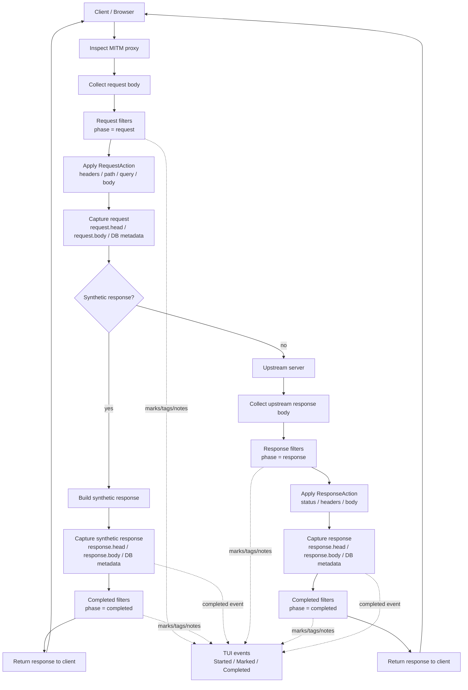

# Roto Filters

Inspect can load Roto scripts from the `filters/` directory and use them to filter, mark, and rewrite HTTP request/response flows.

This feature is currently under active development.

## Overview

Roto filters are stored as `.roto` files under:

```text
filters/*.roto
```

Each file can define metadata in TOML front matter and one or more Roto functions.

Filters can currently run in these phases:

- `request`
- `response`
- `completed`

## Where filters run

Roto filters run inside the HTTP MITM flow after request/response bodies are collected.



Current filtering points:

| Phase | Can inspect | Can modify | Can synthesize response | Typical use |
| --- | --- | --- | --- | --- |
| `request` | request metadata, headers, body | request method/path/query/headers/body | yes | mock, request rewrite, marking |
| `response` | response metadata, headers, body | response status/headers/body | no | response rewrite, marking |
| `completed` | completed flow | no request/response rewrite | no | final marks/tags/notes, future outbound jobs |


The main use cases are:

- mark matching flows in the TUI
- add/remove request headers
- rewrite request body
- return a synthetic response without upstream access
- add/remove response headers
- rewrite response status/body
- run completed-flow hooks

## File format

Each `.roto` file may start with TOML front matter written as comments.

Example:

```rust
//! +++
//! name = "api v1 request"
//! enabled = true
//!
//! [trigger]
//! host = ["*"]
//! path = ["/v1/*", "/mock"]
//! method = ["GET", "POST"]
//! phase = ["request"]
//! +++

fn ping() -> bool {
    true
}

fn request_action(req: Request) -> RequestAction {
    if req.path() == "/mock" {
        RequestAction.pass()
            .mark("mocked")
            .synthetic_response(
                200,
                "<!doctype html><html><body><h1>Hello from Roto</h1></body></html>",
                "text/html; charset=utf-8",
            )
    } else {
        RequestAction.pass()
    }
}
```

## Front matter

Front matter is TOML.

Supported fields:

```toml
name = "filter name"
enabled = true
priority = 100

[trigger]
host = ["*"]
path = ["*"]
method = ["GET", "POST"]
phase = ["request", "response", "completed"]
```

### `name`

Human-readable filter name.

If omitted, the file name is used.

### `enabled`

Whether this filter is enabled.

```toml
enabled = true
```

Disabled filters are skipped.

### `priority`

Controls filter order.

Lower values run earlier.

If omitted, priority is read from the file name prefix.

```text
000-generic.roto        -> priority 0
100-api-v1-request.roto -> priority 100
```

If both TOML `priority` and file name priority are present, TOML wins.

### `trigger`

Controls when a filter runs.

```toml
[trigger]
host = ["*"]
path = ["/v1/*"]
method = ["GET"]
phase = ["request"]
```

If a trigger field is omitted, it is treated as matching all values.

## Trigger matching

### Host

Supports simple glob-like patterns.

Examples:

```text
host = ["*"]
host = ["example.com"]
host = ["*.example.com"]
```

### Path

Supports simple glob-like patterns.

Examples:

```text
path = ["*"]
path = ["/mock"]
path = ["/v1/*"]
```

### Method

Exact match, case-insensitive.

Examples:

```toml
method = ["GET", "POST"]
```

### Phase

Supported values:

```text
phase = ["request"]
phase = ["response"]
phase = ["completed"]
```

Multiple phases can be specified:

```text
phase = ["request", "response"]
```

## Roto syntax notes

Roto method/static calls use `.` rather than Rust-style `::`.

Correct:

```text
RequestAction.pass()
```

Incorrect:

```text
RequestAction::pass()
```

## Why `ping()` is required

Executable Roto filters should define:

```rust
fn ping() -> bool {
    true
}
```

`ping()` is not an HTTP/WebSocket ping and is not related to network keepalive.

Inspect uses it as a simple validation hook when loading a `.roto` file.

The goals are:

- verify that the script compiled successfully
- verify that Inspect can call into the compiled Roto program
- fail the filter early during reload instead of failing later during request handling
- keep runtime request/response processing free from repeated "missing function" checks

If `ping()` is missing or returns an error, the filter file should be treated as invalid and skipped during reload.

TODO:

- [ ] Make the `ping()` error message more explicit.
- [ ] Consider replacing `ping()` with a more descriptive required function name, such as `inspect_filter()` or `validate()`.
- [ ] Consider allowing metadata-only filters without `ping()`.


## Request API

The `Request` object is available in request filters.

Methods:

```text
req.id()
req.method()
req.scheme()
req.host()
req.path()
req.query()
req.content_type()
req.body_text()
req.header("name")
```

Example:

```rust
fn request_action(req: Request) -> RequestAction {
    if req.path() == "/v1/test" && req.method() == "GET" {
        RequestAction.pass().mark("api-v1")
    } else {
        RequestAction.pass()
    }
}
```

## Response API

The `Response` object is available in response filters.

Methods:

```text
res.status()
res.version()
res.content_type()
res.body_text()
res.header("name")
```

Example:

```rust
fn response_action(res: Response) -> ResponseAction {
    if res.status() >= 400 {
        ResponseAction.pass()
            .mark("error-response")
            .set_header("x-inspect-roto", "matched")
    } else {
        ResponseAction.pass()
    }
}
```

## RequestAction API

Preferred request filter function:

```text
fn request_action(req: Request) -> RequestAction
```

Available methods:

```text
RequestAction.pass()
    .mark("label")
    .mark_color("label", "green")
    .set_header("name", "value")
    .remove_header("name")
    .set_path("/new-path")
    .set_query("a=1&b=2")
    .set_body_text("body", "text/plain; charset=utf-8")
    .synthetic_response(200, "body", "text/plain; charset=utf-8")
    .stop()
```

### Marking

```rust
fn request_action(req: Request) -> RequestAction {
    RequestAction.pass()
        .mark("matched")
}
```

Marks are currently shown inline in the TUI packet list.

Example:

```text
#000123 ... [matched] https://example.com/path
```

### Header rewrite

```rust
fn request_action(req: Request) -> RequestAction {
    RequestAction.pass()
        .set_header("x-roto", "request")
        .remove_header("x-remove-me")
}
```

### Body rewrite

```rust
fn request_action(req: Request) -> RequestAction {
    RequestAction.pass()
        .set_body_text("rewritten request body\n", "text/plain; charset=utf-8")
}
```

When a body is rewritten, Inspect removes body integrity/encoding headers such as:

- `content-length`
- `content-encoding`
- `etag`
- `content-md5`

### Synthetic response

A request filter can return a response directly without sending the request upstream.

```rust
fn request_action(req: Request) -> RequestAction {
    if req.path() == "/mock" {
        RequestAction.pass()
            .mark("mocked")
            .synthetic_response(
                200,
                "<!doctype html><html><body><h1>Hello from Roto</h1></body></html>",
                "text/html; charset=utf-8",
            )
    } else {
        RequestAction.pass()
    }
}
```

Synthetic responses stop further request filters.

Current behavior:

- response is returned to the browser
- response metadata/body should be captured like normal responses
- upstream access is skipped
- upstream metadata should be stored as absent/null

Known TODOs are listed below.

### Stop filter chain

```rust
fn request_action(req: Request) -> RequestAction {
    RequestAction.pass()
        .mark("stop-here")
        .stop()
}
```

When `stop()` is used, later matching filters are not executed.

## ResponseAction API

Preferred response filter function:

```text
fn response_action(res: Response) -> ResponseAction
```

Available methods:

```text
ResponseAction.pass()
    .mark("label")
    .mark_color("label", "red")
    .set_status(418)
    .set_header("name", "value")
    .remove_header("name")
    .set_body_text("body", "text/plain; charset=utf-8")
    .stop()
```

### Response status rewrite

```rust
fn response_action(res: Response) -> ResponseAction {
    if res.status() == 404 {
        ResponseAction.pass()
            .mark("rewritten-404")
            .set_status(200)
            .set_body_text("rewritten\n", "text/plain; charset=utf-8")
    } else {
        ResponseAction.pass()
    }
}
```

### Response body rewrite

```rust
fn response_action(res: Response) -> ResponseAction {
    ResponseAction.pass()
        .set_body_text(
            "<!doctype html><html><body><h1>Rewritten</h1></body></html>",
            "text/html; charset=utf-8",
        )
}
```

When a response body is rewritten, Inspect removes body integrity/encoding headers such as:

- `content-length`
- `content-encoding`
- `etag`
- `content-md5`

## Header rewrite behavior

### `set_header`

```text
RequestAction.pass()
    .set_header("x-example", "one")
```

```text
ResponseAction.pass()
    .set_header("x-example", "one")
```

Current behavior:

- header names are parsed using HTTP header name rules
- invalid header names are ignored and logged
- invalid header values are ignored and logged
- setting a header uses replacement semantics for that header name
- if the same header is set multiple times, the last value wins

Example:

```rust
fn response_action(res: Response) -> ResponseAction {
    ResponseAction.pass()
        .set_header("x-example", "one")
        .set_header("x-example", "two")
}
```

Expected final header:

```http
x-example: two
```

This means `set_header` is currently not an append operation.

TODO:

- [ ] Add explicit append support, e.g. `append_header("set-cookie", "...")`.
- [ ] Define special handling for multi-value headers.
- [ ] Define safer APIs for `set-cookie`, `cookie`, and comma-joined headers.
- [ ] Add `replace_header` alias if we want the API name to be clearer.

### `remove_header`

```text
RequestAction.pass()
    .remove_header("x-example")
```

```text
ResponseAction.pass()
    .remove_header("x-example")
```

Current behavior:

- header names are parsed using HTTP header name rules
- invalid names are ignored and logged
- removal is case-insensitive at HTTP header-map level

### Remove and set order

When applying a patch, Inspect removes headers first and then sets headers.

So this action:

```rust
fn response_action(res: Response) -> ResponseAction {
    ResponseAction.pass()
        .remove_header("x-example")
        .set_header("x-example", "new")
}
```

results in:

```http
x-example: new
```

TODO:

- [ ] Decide whether method call order should be preserved exactly.
- [ ] Consider representing header operations as an ordered list instead of separate `remove_headers` and `set_headers`.

## Path and query rewrite behavior

Request filters can rewrite path and query.

```rust
fn request_action(req: Request) -> RequestAction {
    RequestAction.pass()
        .set_path("/new-path")
        .set_query("a=1&b=2")
}
```

Current behavior:

- `set_path()` replaces the URI path component
- `set_query()` replaces the URI query component
- if only path is set, the original query is preserved
- if only query is set, the original path is preserved
- invalid path/query combinations are ignored and logged

### Multiple calls in one action

If the same field is set multiple times in one action, the last value wins.

```rust
fn request_action(req: Request) -> RequestAction {
    RequestAction.pass()
        .set_path("/first")
        .set_path("/second")
}
```

Expected final path:

```text
/second
```

### Clearing query

Current API does not clearly distinguish:

- preserve existing query
- set query to empty
- remove query entirely

TODO:

- [ ] Define exact behavior for `set_query("")`.
- [ ] Add `remove_query()`.
- [ ] Add query helper APIs such as `set_query_param`, `remove_query_param`, and `append_query_param`.

## Body rewrite behavior

Request and response bodies can be rewritten as text.

```text
RequestAction.pass()
    .set_body_text("new request body\n", "text/plain; charset=utf-8")
```

```text
ResponseAction.pass()
    .set_body_text("new response body\n", "text/plain; charset=utf-8")
```

When a body is rewritten, Inspect removes headers that may no longer be valid:

```text
content-length
content-encoding
etag
content-md5
```

### Why these headers are removed

These headers often describe the original body bytes.

After rewriting the body:

- `content-length` may be wrong
- `content-encoding` may claim compression that no longer exists
- `etag` may no longer identify the body
- `content-md5` may no longer match the body

Keeping them can cause browser/protocol errors, corrupted rendering, or cache/integrity mismatches.

### Is `content-length` recalculated?

Inspect currently removes `content-length` when rewriting the body.

Inspect does not explicitly recalculate and reinsert `content-length` inside the Roto patch application itself.

The HTTP server/client stack may still frame the response correctly using the protocol's normal behavior, for example:

- HTTP/1.1 connection framing or chunked transfer
- HTTP/2 frame lengths
- automatically added required headers by lower layers

However, from the filter/capture point of view, rewritten bodies should be treated as having no explicit `content-length` unless a later layer adds one.

TODO:

- [ ] Decide whether Inspect should explicitly set a new `content-length` after body rewrite.
- [ ] Add tests for HTTP/1.1 rewritten body framing.
- [ ] Add tests for HTTP/2 rewritten body framing.
- [ ] Document capture behavior if lower layers add or omit `content-length`.
- [ ] Consider preserving compression by recompressing rewritten bodies, but only as an explicit future feature.

### Content type

If a content type is provided, Inspect sets `content-type` to that value.

```text
ResponseAction.pass()
    .set_body_text("<h1>Hello</h1>", "text/html; charset=utf-8")
```

If the content type is invalid, it is ignored and logged.

TODO:

- [ ] Add binary body rewrite API.
- [ ] Add JSON helper API.
- [ ] Add HTML helper API.

## Mark colors

Marks can optionally carry a color.

```rust
fn request_action(req: Request) -> RequestAction {
    RequestAction.pass()
        .mark_color("important", "red")
}
```

Current behavior:

- `mark(label)` creates a mark without an explicit color
- `mark_color(label, color)` stores the color string in the action
- the color string is currently not strictly validated
- TUI rendering currently focuses on the label and may not visually apply the color yet

Recommended color names for future compatibility:

```text
red
green
yellow
blue
magenta
cyan
white
gray
```

Current built-in conventions:

| Source | Default color intent |
| --- | --- |
| `mark(...)` | none/default |
| tags emitted as marks | green |
| notes emitted as marks | blue |

TODO:

- [ ] Define the official color palette.
- [ ] Validate color names during action conversion.
- [ ] Render colors in the packet list.
- [ ] Render marks/tags/notes in the detail pane.
- [ ] Decide how unknown colors should behave.


## Action merge and conflict behavior

Multiple filters can match the same request or response.

Filters are evaluated in priority order:

1. lower `priority` first
2. then file path/name order as a tie-breaker

Each filter returns an action. Inspect merges these actions into one combined action.

### Marks, tags, and notes

Marks, tags, and notes are accumulated.

Example:

```text
RequestAction.pass().mark("a")
```

and later:

```text
RequestAction.pass().mark("b")
```

results in both marks being emitted:

```text
[a] [b]
```

### `stop()`

Calling `stop()` stops later matching filters.

```rust
fn request_action(req: Request) -> RequestAction {
    RequestAction.pass()
        .mark("stop-here")
        .stop()
}
```

Synthetic responses also stop request filter processing.

### Request/response patches

Current behavior is intentionally simple but has important limitations.

If multiple filters return request patches, later patches can replace earlier patches instead of deeply merging every field.

For example, if one filter sets a header and a later filter sets a body, the current merge behavior may replace the request patch object instead of combining both changes.

TODO:

- [ ] Change action merge to deep-merge patches.
- [ ] Define precise conflict rules for each field.
- [ ] Add tests for multi-filter merge behavior.
- [ ] Document whether "first wins" or "last wins" for each action field.

## Completed phase

The `completed` phase runs after request and response processing has completed.

It can be used for final marking/tagging/note hooks.

Current completed filters can emit:

- marks
- tags
- notes
- outbound HTTP jobs, currently not wired

Completed filters do not currently rewrite request/response data.

## Runtime and reload behavior

Inspect loads filters from:

```text
./filters
```

The filter manager:

- loads `.roto` files on startup
- polls the directory for changes
- reloads changed filters
- compiles filters at reload time
- keeps the previous filter set if reload fails
- skips only the failing file if a single filter fails
- swaps the current filter set atomically enough for active request handling

Compiled function handles are kept after reload, so requests/responses do not recompile scripts per packet.

## Logging

Filter reload logs include useful diagnostics:

- filters directory
- absolute filters directory
- current working directory
- filter name
- priority
- path
- enabled
- program kind
- available functions
- trigger host/path/method/phase

Request/response matching also logs matched filters.

## Example filters

### Request filter

```rust
//! +++
//! name = "api v1 request"
//! enabled = true
//!
//! [trigger]
//! host = ["*"]
//! path = ["/v1/*", "/mock"]
//! method = ["GET", "POST"]
//! phase = ["request"]
//! +++

fn ping() -> bool {
    true
}

fn request_action(req: Request) -> RequestAction {
    if req.path() == "/mock" {
        RequestAction.pass()
            .mark("mocked")
            .synthetic_response(
                200,
                "<!doctype html><html><body><h1>Hello from Roto</h1><p>synthetic response</p></body></html>",
                "text/html; charset=utf-8",
            )
    } else if req.path() == "/v1/test" {
        RequestAction.pass()
            .mark("api-v1-action")
            .set_header("x-roto-api-v1", "matched-by-action")
    } else {
        RequestAction.pass()
    }
}
```

### Response filter

```rust
//! +++
//! name = "generic"
//! enabled = true
//!
//! [trigger]
//! host = ["*"]
//! path = ["*"]
//! phase = ["response"]
//! +++

fn ping() -> bool {
    true
}

fn response_action(res: Response) -> ResponseAction {
    if res.status() >= 400 {
        ResponseAction.pass()
            .mark("4xx-action")
            .set_header("x-roto-status-class", "4xx")
            .set_body_text("rewritten by response_action\n", "text/plain; charset=utf-8")
    } else {
        ResponseAction.pass()
    }
}
```

## Current limitations

### Synthetic response capture

Synthetic responses are intended to follow the same capture path as upstream responses.

Expected behavior:

- save `response.head`
- save `response.body`
- send response metadata to DB
- send `PacketEvent::Completed`
- show final status in TUI
- allow detail pane to show request/response normally

Important details:

- `upstream_status` should be `None`
- `upstream_remote_addr` should be `None`
- `tls_upstream` should be `None`
- elapsed time should be measured from request start to synthetic response generation

### Request metadata for synthetic responses

Synthetic responses must not bypass request metadata capture.

The request should still be saved:

- `request.head`
- `request.body`
- request DB metadata
- TUI started event

### Response head after patch

For response rewrites, `response.head` should be saved after applying `response_action` patches.

Otherwise the captured head can differ from the actual response sent to the client.

### Filter directory path

`FilterManager::new("./filters")` should resolve the directory to an absolute path to avoid current-working-directory surprises.

## TODO

### High priority

- [ ] Ensure synthetic responses always save request metadata before early return.
- [ ] Ensure synthetic responses save response metadata/body/head.
- [ ] Ensure synthetic responses write `ssl_tls.json`.
- [ ] Ensure synthetic responses emit TUI completed events.
- [ ] Save `response.head` after response patches.
- [ ] Make synthetic response force `continue_filters = false`.
- [ ] Resolve filter directory to an absolute path at `FilterManager::new`.

### Medium priority

- [ ] Persist marks/tags/notes in the capture DB.
- [ ] Improve TUI mark/tag display to avoid very long packet rows.
- [ ] Add detail-pane display for marks/tags/notes.
- [ ] Add more tests for trigger matching.
- [ ] Add tests for request/response patch application.
- [ ] Add tests for synthetic response capture path.
- [ ] Add examples for completed filters.
- [ ] Document exact Roto type signatures generated by the runtime.

### Future work

- [ ] Wire named outbound HTTP jobs.
- [ ] Add named HTTP clients, e.g. Elasticsearch sink.
- [ ] Use bounded queues for outbound jobs.
- [ ] Keep arbitrary filesystem/process/network access unavailable from Roto.
- [ ] Add richer action APIs for tags and notes.
- [ ] Consider color handling for marks in TUI.
- [ ] Add a filter validation command.
- [ ] Add CLI option for filters directory.
- [ ] Add reload status/errors to TUI.

## Security model

Roto filters should be treated as local trusted configuration.

The intended design is:

- Roto can inspect request/response metadata and bodies.
- Roto can return structured actions.
- Roto should not get arbitrary filesystem access.
- Roto should not get arbitrary process execution.
- Roto should not get arbitrary network access.
- Future outbound HTTP should be limited to named clients configured by Inspect.

## Design notes

The recommended API is action-based:

```text
fn request_action(req: Request) -> RequestAction
fn response_action(res: Response) -> ResponseAction
```

This keeps Roto scripts declarative and lets Rust own the actual side effects:

- HTTP header mutation
- body rewrite
- synthetic response construction
- capture persistence
- TUI events
- future outbound jobs

This also keeps the runtime easier to reason about and safer to extend.